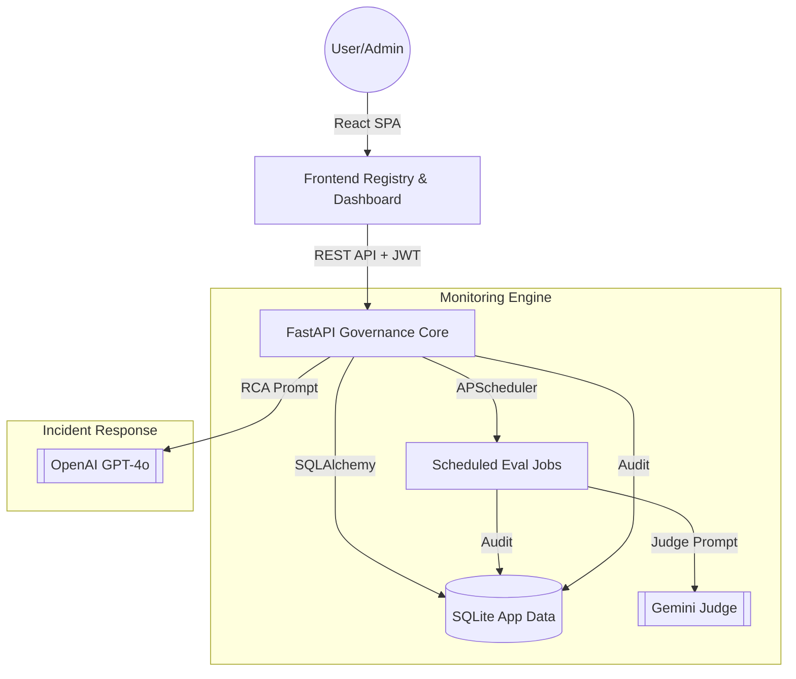

# 🛰️ AI Operations Control Room
**ARTI-409-A | Enterprise AI Governance, Monitoring & Incident Response**

The **AI Operations Control Room** is a comprehensive governance and monitoring platform designed to centralize oversight of deployed AI services. It bridges the gap between raw model performance and enterprise-grade reliability, enforcing strict compliance guardrails while providing deep visibility into model quality and operational health.

---

## 🚀 Key Features

### ⚖️ AI Governance & Service Registry
- **Centralized Oversight**: Register and manage cross-organizational AI services across multiple environments (Dev, Prod, Staging).
- **Metadata Management**: Track model versions, owners, data sensitivity tiers (Public, Internal, Confidential), and system prompts in a unified registry.

### 🧪 Automated Evaluation Harness
- **Hybrid Scoring Engine**: Assess model quality using a blend of deterministic exact-match scorers (for math/PII) and **LLM-as-a-Judge (Gemini 1.5/2.5)** for semantic reasoning and factuality.
- **Golden Dataset Testing**: Run evaluations against curated "Golden Question" sets to ensure models meet performance thresholds before and after deployment.
- **Scheduled Monitoring**: Automated background jobs (APScheduler) trigger periodic evaluations to capture performance metrics over time.

### 📉 Real-time Drift Detection
- **Semantic Shift Analysis**: Uses LLM-driven "Drift Judges" (Gemini/OpenAI/Claude) to compare production samples against historical baselines.
- **Trend Visualization**: Interactive Recharts-based dashboards visualize quality scores, latency, and drift severity trends.

### 🚑 Incident Triage & Response
- **LLM-Assisted RCA**: Automated root cause analysis generated by GPT-4o for every detected anomaly.
- **Human-in-the-loop (HITL)**: Enforced approval workflows for incident closure and maintenance plans, ensuring human accountability for AI remediation.
- **Post-Mortem Documentation**: Automatic generation and persistence of incident narratives for compliance reporting.

### 🛡️ JIT Security & RBAC
- **Just-In-Time Elevation**: A secure workflow allowing Maintainers to request temporary, time-bound **Admin** privileges for sensitive operations (e.g., auditing logs).
- **Tamper-Evident Audit Log**: Every system write action, role change, and evaluation trigger is recorded in an immutable audit trail.
- **JWT-Based Authentication**: Secure session management with encrypted token exchange and automatic session refresh.

---

## 🛠️ Technology Stack

| Layer | Technologies |
| :--- | :--- |
| **Frontend** | React 18, Vite, TailwindCSS, Recharts, Framer Motion |
| **Backend** | FastAPI (Python 3.10+), SQLAlchemy, Pydantic |
| **Database** | SQLite (Production-ready migrations included) |
| **AI Models** | Google Gemini (Judge), OpenAI GPT-4o (Reasoning), Anthropic Claude |
| **Task Queue** | APScheduler (Background job orchestration) |
| **Security** | JWT, Passlib (bcrypt), Jose (JWS/JWT) |

---

## 🏗️ Architecture



---

## 📦 Setup & Installation

### Prerequisites
- **Python 3.10+**
- **Node.js 18+**
- **Git**

### Backend Setup
1. Navigate to the backend directory:
   ```bash
   cd backend
   ```
2. Create and activate a virtual environment:
   ```bash
   python -m venv venv
   # Windows:
   venv\Scripts\activate
   # macOS/Linux:
   source venv/bin/activate
   ```
3. Install dependencies:
   ```bash
   pip install -r requirements.txt
   ```
4. Configure environment variables:
   ```bash
   cp .env.example .env
   # Edit .env with your API keys:
   # OPENAI_KEY=sk-...
   # GEMINI_API_KEY=AIza...
   ```
5. Run the server:
   ```bash
   uvicorn main:app --reload
   ```

### Frontend Setup
1. Navigate to the frontend directory:
   ```bash
   cd frontend
   ```
2. Install dependencies:
   ```bash
   npm install
   ```
3. Run the development server:
   ```bash
   npm run dev
   ```
4. Open your browser to `http://localhost:5173`.

---

## 👥 Test Credentials

| Role | Username | Password | Access Level |
| :--- | :--- | :--- | :--- |
| **Admin** | `admin` | `admin123` | Full Access + Audit Logs |
| **Maintainer** | `maintainer` | `maint123` | Run Evals + Manage Incidents |
| **Viewer** | `viewer` | `view123` | Read-only Dashboards |

---

## 📜 Compliance & Responsible AI
- **Transparency**: Clear routing between cloud (OpenAI/Gemini) and local model providers.
- **Security**: Deterministic refusal checks for adversarial prompt detection.
- **Privacy**: Support for data sensitivity labeling and "Confidential" data masking policies.
- **Evidence**: One-click export of audit logs for SOC2/GDPR compliance audits.